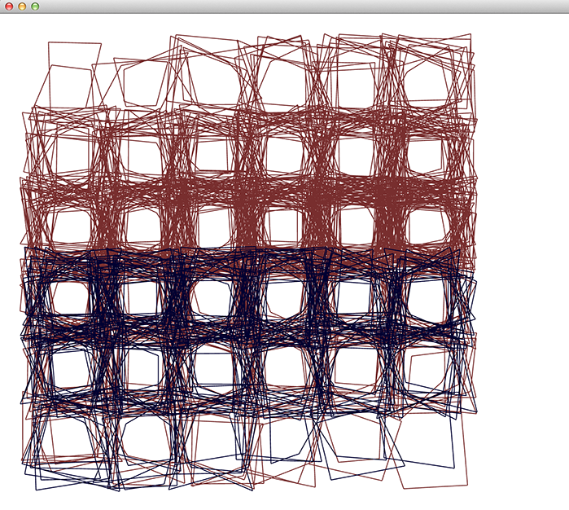
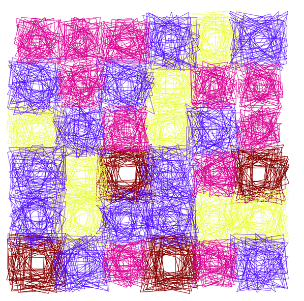

# SFPC
code made during the SFPC Fall session

Most of these projects are made using openframeworks 0.9

####VERA1

The colors dont match the original but theres a GUI to change them.

####VERA2

The colors dont match the original but theres a GUI to change them.
